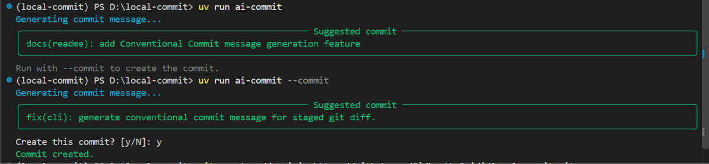

# Local Commit

A privacy-focused AI CLI that uses a locally running Ollama large language model (LLM) to analyze staged Git changes and generate high-quality Conventional Commit messages. By default, it uses `llama3.2:latest` with a 1-billion-parameter model.

## Features

- Reads only staged Git changes
- Generates Conventional Commit messages
- Uses Ollama locally
- Supports configurable models
- Keeps source code and diffs private by running inference locally
- Uses focused prompts to turn code changes into concise, contextual messages
- Optionally creates commits after confirmation

## Architecture

- `cli.py` - CLI commands and workflow
- `git.py` - Git status, diff, and commit operations
- `prompts.py` - Builds the LLM prompt
- `ollama.py` - Communicates with Ollama
- `config.py` - Loads TOML configuration

## AI and LLM

The tool sends only the staged Git diff to Ollama. The configured LLM analyzes the
change, identifies its intent, and returns a single Conventional Commit message.
No cloud AI service or API key is required. You can switch to any Ollama-compatible
model through the configuration file.

## Technology

- Python 3.11
- Typer
- Rich
- HTTPX
- Ollama local inference runtime
- Llama 3.2 (default LLM)
- Git CLI
- TOML
- uv

## Workflow

```text
git add
   ↓
Read staged diff
   ↓
Build prompt
   ↓
Send to Ollama
   ↓
Generate commit message
   ↓
Confirm and commit
```

## Usage

```shell
git add .
uv run ai-commit
uv run ai-commit --commit
```

## Configuration

```toml
model = "llama3.2:latest"
ollama_url = "http://localhost:11434"
max_diff_chars = 12000
```

## Result



